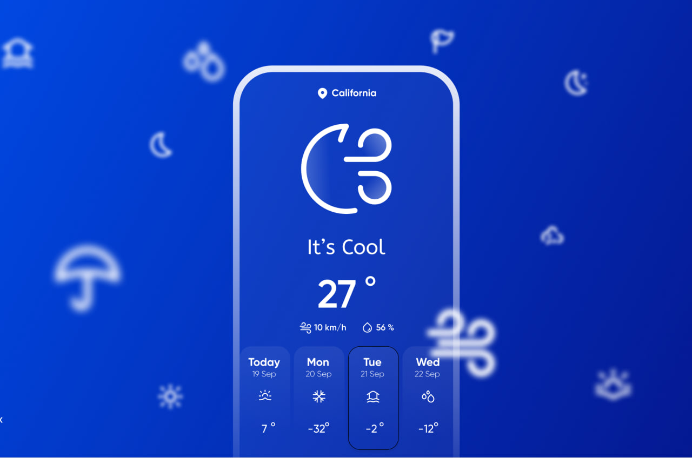

## Screenshots

## About The Project
  
This Weather App was developed by using Kotlin Multiplatform with Compose Multiplatform.

## Architecture
MVVM (Model-View-ViewModel) architecture pattern has been used in the development of this application. The development language of the application is Kotlin.

* Architecture;
    * ViewModel
    * Koin
    * DataStore
## Tech Stacks
This project uses many of the popular libraries, plugins and tools of the android ecosystem.
 
- [Compose](https://developer.android.com/jetpack/compose)
    - [Material](https://developer.android.com/jetpack/androidx/releases/compose-material) - Build Jetpack Compose UIs with ready to use Material Design Components.
    - [Foundation](https://developer.android.com/jetpack/androidx/releases/compose-foundation) - Write Jetpack Compose applications with ready to use building blocks and extend foundation to build your own design system pieces.
    - [UI](https://developer.android.com/jetpack/androidx/releases/compose-ui) - Fundamental components of compose UI needed to interact with the device, including layout, drawing, and input.
    - [Lifecycle-ViewModel](https://developer.android.com/jetpack/androidx/releases/lifecycle) - Perform actions in response to a change in the lifecycle status of another component, such as activities and fragments.
- [Jetpack](https://developer.android.com/jetpack)
    - [AndroidX](https://developer.android.com/jetpack/androidx) - Major improvement to the original Android [Support Library](https://developer.android.com/topic/libraries/support-library/index), which is no longer maintained.
    - [Lifecycle](https://developer.android.com/topic/libraries/architecture/lifecycle) - Perform actions in response to a change in the lifecycle status of another component, such as activities and fragments.
    - [ViewModel](https://developer.android.com/topic/libraries/architecture/viewmodel) - Designed to store and manage UI-related data in a lifecycle conscious way. The ViewModel class allows data to survive configuration changes such as screen rotations.
 
    - ## Features
  - The users can view - The users can view current weather and weather forecast
  - The users can change country, city, etc

  
